## Prerequisites :

* Java 8 installed
* VS Code IDE.

# 1: UDP-Go Back N Protocol

[Github link](https://github.com/ravirao1208/UDP_Go_Back_N-Protocol.git)
There are  two Subfolders assocaited with UDP - Go back N

1. UDP\_GO\_BACK\_N\_CLIENT
2. UDP\_GO\_BACK\_N\_SERVER

Always run server first and then run the client

#### 1.1: UDP\_GO\_BACK\_N\_SERVER :

The job of this module is to accept packet and store it in the file and also send ACK back for the packet received.
Following are the step to be followed to run the UDP\_GO\_BACK\_N\_SERVER

1. Click on the Run and Debug icon on the IDE.
2. Select ServerApp<UDP\_GO\_BACK\_N\_SERVER>  from the launch config file.
3. As the you select and run new terminal will pop
    * Enter server port number (eg: 9093)
    * Enter file name to where the packets to be stored (eg : serverCopyFile)
    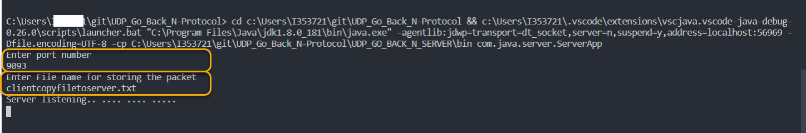

#### 1.2: UDP\_GO\_BACK\_N\_CLIENT :

Job of this module is to transer the file packets to UDP server and also makes sures that with in the time limit if ACK is not received for the packet sent current window packets are retransmitted.
Following are the step to be followed to run the UDPclient

1. Click on the Run and Debug icon on the IDE
2. Select ClientApp<UDP\_GO\_BACK\_N\_CLIENT>  from the launch config file.
3. As the you select and run new terminal will pop there
    * Enter the server HostName  as localhost if the server is running with in the server if not please pass valid hostname (eg : localhost)
    * Enter Server port number (eg: 9093)
    * Enter the window size (eg: 5)
    * Entet the Max Segment size ( < 2001) (eg: 2000)
    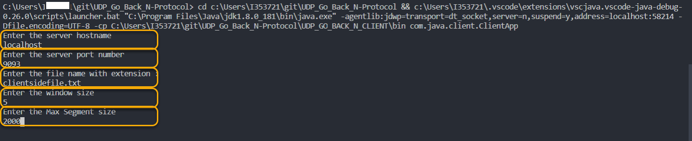

##### \*\*Note : observe the terminal for packet transmission and ACK \*\*

Client :
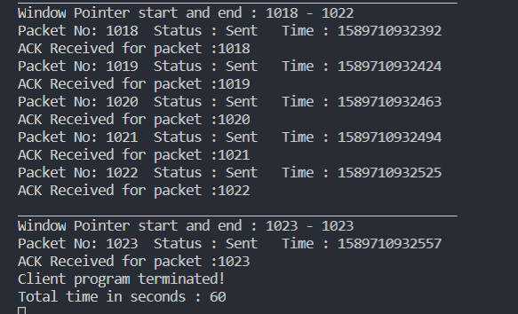

Server :
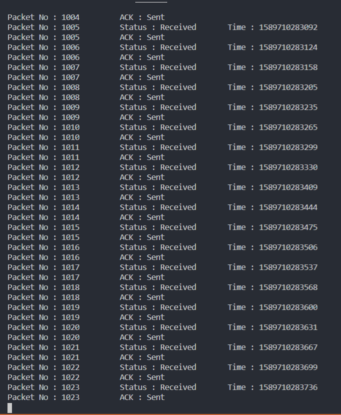

#### 1.3: Output:

At the end of file transmission you can find  file created in the UDP\_GO\_BACK\_N\_SERVER/resources/serverfiles/\<filename that you gave> with data in it.

# 2: UDP SELECTIVE REPEAT:

There are  two Subfolders assocaited with UDP SELECTIVE REPEAT

1. UDP\_SELECTIVE\_REPEAT\_CLIENT
2. UDP\_SELECTIVE\_REPEAT\_SERVER

Always run server first and then run the client

#### 2.1: UDP\_SELECTIVE\_REPEAT\_SERVER :

The job of this module is to accept packet and store it in the file and also send ACK back for the packet received.
Following are the step to be followed to run the UDP\_SELECTIVE\_REPEAT\_SERVER

1. Click on the Run and Debug icon on the IDE.
2. Select ServerApp<UDP\_SELECTIVE\_REPEAT\_SERVER>  from the launch config file.
3. As the you select and run new terminal will pop. In the terminal you can observe the packets getting received.
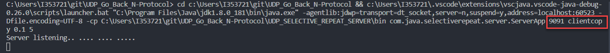

#### 2.2: UDP\_SELECTIVE\_REPEAT\_CLIENT :

Job of this module is to transer the file packets to UDP server and also makes sures that with in the time limit if ACK is not received for the packet sent the packets lost are retransmitted.
Following are the step to be followed to run the UDPclient

1. Click on the Run and Debug icon on the IDE
2. Select ClientApp<UDP\_SELECTIVE\_REPEAT\_CLIENT>  from the launch config file.
3. As the you select and run new terminal will pop. In the terminal you can observe the packets getting transferred.
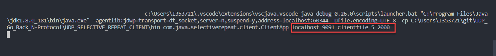

#### \*\*Note : observe the terminal for packet transmission and ACK \*\*

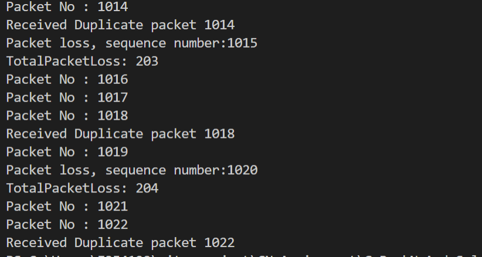

#### Output:

At the end of file transmission you can find  file created in the UDP\_SELECTIVE\_REPEAT\_SERVER/resources/serverfiles/\<filename that you gave in arguments> with data in it.

# 3: Standard TCP and UDP Implementation

#### 3.1.1: TCP Standard

There are  two subfolders assocaited with TCP - Standard

1. TCP\_STANDARD\_CLIENT
2. TCP\_STANDARD\_SERVER

Always run server first and then run the client

#### TCP\_STANDARD\_SERVER:

The job of this module is to accept a filename from the request and serve the file in response to the request.
Following are the step to be followed to run the TCP\_STANDARD\_SERVER:

1. Click on the Run and Debug icon on the IDE.
2. Select <TCP\_STANDARD\_SERVER> from the launch config file.
3. As the you select and run new terminal will pop. You can see that the server is now serving files in the resources folder in the directory TCP\_STANDARD\_SERVER.

#### TCP\_STANDARD\_CLIENT:

The job of this module is to request for a file from the server and accept the file received as response and store it.

Following are the step to be followed to run the TCP\_STANDARD\_CLIENT:

1. Click on the Run and Debug icon on the IDE.
2. Select <TCP\_STANDARD\_CLIENT> from the launch config file.
3. As the you select and run new terminal will pop. You can see that the client is requesting for a file 'demo\_file.txt' from the server.

#### 3.1.2: Output:

At the end of file transmission you can find the file transferred and written into the 'received' directory as 'received\_file.txt'

#### Screenshots - TCP

Server:
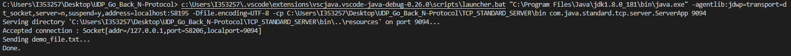

Client:
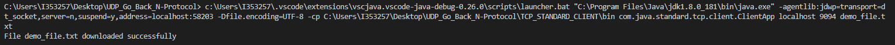

#### 3.2.1: UDP Standard

There are  two subfolders assocaited with TCP - Standard

1. UDP\_STANDARD\_CLIENT
2. UDP\_STANDARD\_SERVER

Always run server first and then run the client

#### UDP\_STANDARD\_SERVER:

The job of this module is to accept a filename from the request and serve the file in response to the request.
Following are the step to be followed to run the UDP\_STANDARD\_SERVER:

1. Click on the Run and Debug icon on the IDE.
2. Select <UDP\_STANDARD\_SERVER> from the launch config file.
3. As the you select and run new terminal will pop. You can see that the server is now serving files in the resources folder in the directory UDP\_STANDARD\_SERVER.

#### UDP\_STANDARD\_CLIENT:

The job of this module is to request for a file from the server and accept the file received as response and store it.

Following are the step to be followed to run the UDP\_STANDARD\_CLIENT:

1. Click on the Run and Debug icon on the IDE.
2. Select <UDP\_STANDARD\_CLIENT> from the launch config file.
3. As the you select and run new terminal will pop. You can see that the client is requesting for a file 'demo\_file.txt' from the server.

#### 3.2.2: Output:

At the end of file transmission you can find the file transferred and written into the 'received' directory as 'received\_file.txt'

#### Screenshots - UDP

Server:
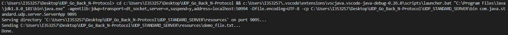

Client:
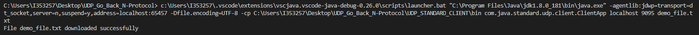
