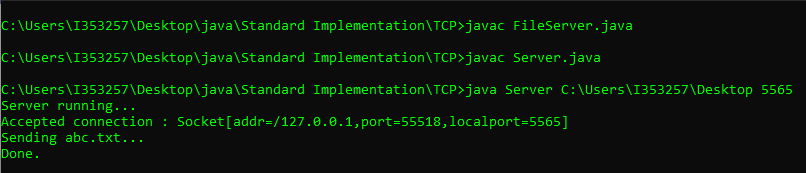
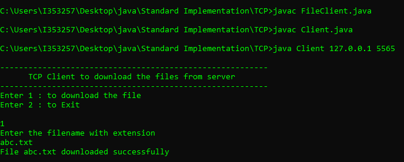
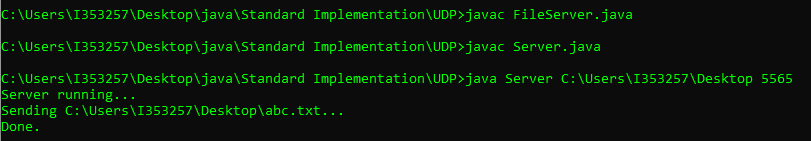
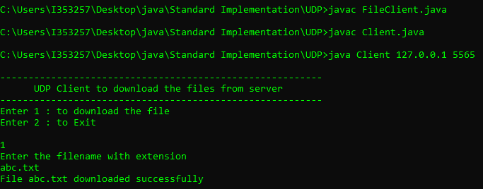

# Standard Implementation - TCP and UDP

#### Prerequisites:

* Java 8 installed

## TCP Implementation

Open Command Prompt. Navigate to the directory **TCP**

1. Compile FileServer.java program
<pre>javac FileServer.java</pre>
2. Compile Server.java program
<pre>javac Server.java</pre>

3. Run Server program
<pre>java Server [directory-to-be-served] [port]</pre>
example:
<pre>java Server C:\Users\I353257\Desktop 5565</pre>

Open a separate Command prompt window in the same directory.

4. Compile FileClient.java program
<pre>javac FileClient.java</pre>
5. Compile Client.java program
<pre>javac Client.java</pre>
6. Run Client program
<pre>java Client [IP-Address] [port]</pre>
example:
<pre>java Client 127.0.01 5565</pre>

### Screenshots - TCP

Server: 

Client: 

### Output:

The file that was requested will be transferred to the directory wherein the Client program is running from.

## UDP Implementation

Open Command Prompt. Navigate to the directory **UDP**

1. Compile FileServer.java program
<pre>javac FileServer.java</pre>
2. Compile Server.java program
<pre>javac Server.java</pre>

3. Run Server program
<pre>java Server [directory-to-be-served] [port]</pre>
example:
<pre>java Server C:\Users\I353257\Desktop 5565</pre>

Open a separate Command prompt window in the same directory.

4. Compile FileClient.java program
<pre>javac FileClient.java</pre>
5. Compile Client.java program
<pre>javac Client.java</pre>
6. Run Client program
<pre>java Client [IP-Address] [port]</pre>
example:
<pre>java Client 127.0.01 5565</pre>

### Screenshots - UDP

Server: 

Client: 

### Output:

The file that was requested will be transferred to the directory wherein the Client program is running from.